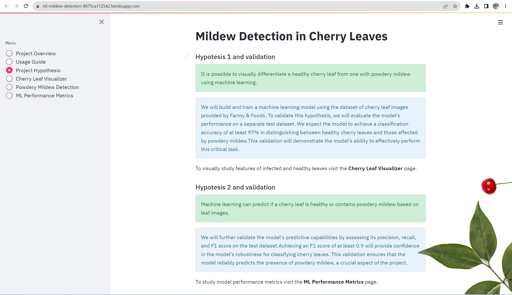

# Powdery Mildew Detection in Cherry Leaves (ML project)

Live application is available [here.](https://ml-mildew-detection-8675ca112542.herokuapp.com/)

This project employs data science and machine learning to detect powdery mildew on cherry leaves, distinguishing between healthy and diseased ones. It features a binary classification machine learning model accessible via a Streamlit dashboard for leaf health prediction. Additionally, the project includes traditional data analysis findings, detailed hypothesis examination, and model performance evaluation.

To streamline the workflow, the project utilizes three Jupyter notebooks: one for data import and cleaning, another for data visualization, and the third for developing and assessing a TensorFlow deep learning model. These notebooks provide a structured approach to data management and model development.

The primary goal is to improve powdery mildew detection on cherry leaves, aiding growers in effectively identifying and treating diseased cherry trees. Leveraging machine learning and data analysis, this project aims to offer an efficient, user-friendly solution for distinguishing between healthy and diseased cherry leaves.
___

## Table of Contents

- [Powdery Mildew Detection in Cherry Leaves (ML project)](#powdery-mildew-detection-in-cherry-leaves-ml-project)
  - [Table of Contents](#table-of-contents)
- [Planning Phase](#planning-phase)
  - [Agile methodology - Development](#agile-methodology---development)
  - [Crisp-DM: Definition and Usage](#crisp-dm-definition-and-usage)
  - [Business Requirements](#business-requirements)
  - [Hypothesis and Validation](#hypothesis-and-validation)
- [Data Gathering Phase](#data-gathering-phase)
  - [Dataset Content](#dataset-content)
  - [Rationale to map the business requirements to the Data Visualizations and ML tasks](#rationale-to-map-the-business-requirements-to-the-data-visualizations-and-ml-tasks)
  - [Data Understanding](#data-understanding)
- [Project Execution Phase](#project-execution-phase)
  - [Data Preparation](#data-preparation)
  - [Modeling](#modeling)
  - [Evaluation](#evaluation)
  - [Dashboard Design](#dashboard-design)
  - [Bugs and Fixes](#bugs-and-fixes)
  - [Manual Testing](#manual-testing)
  - [Features for future implementation](#features-for-future-implementation)
  - [Deployment](#deployment)
    - [Heroku](#heroku)
    - [Forking the GitHub Project](#forking-the-github-project)
    - [Making a Local Clone](#making-a-local-clone)
- [Summary](#summary)
  - [Technologies Used](#technologies-used)
    - [Main Data Analysis and Machine Learning Libraries](#main-data-analysis-and-machine-learning-libraries)
    - [Other Frameworks, Libraries \& Programs Used](#other-frameworks-libraries--programs-used)
  - [Credits](#credits)
    - [Media](#media)
  - [Acknowledgements](#acknowledgements)
---

# Planning Phase

## Agile methodology - Development

- Agile with Kanban is chosen for project management to promote flexibility, adaptability, and efficient issue tracking throughout the project's lifecycle.
- Find the Kanban board Project [here.](https://github.com/users/Edmir-Demaj/projects/9)

## Crisp-DM: Definition and Usage

CRISP-DM (Cross-Industry Standard Process for Data Mining) is a structured approach to data mining and analytics projects, also known as a framework. It consists of the following stages:

1. **Understand:** Define the business problem, objectives, and goals.
2. **Data:** Collect and explore data, ensuring its quality and relevance.
3. **Prepare:** Clean, transform, and engineer data for analysis.
4. **Model:** Select and build appropriate predictive models.
5. **Evaluate:** Assess model performance and alignment with project goals.
6. **Deploy:** Implement the chosen model into production.
7. **Monitor:** Continuously track and maintain model performance.

## Business Requirements

The cherry plantation crop from Farmy & Foods faces a challenge where their cherry plantations have been presenting powdery mildew. Currently, the process is to verify if a given cherry tree contains powdery mildew manually. An employee spends around 30 minutes in each tree, taking a few samples of tree leaves and demonstrating visually if the leaf tree is healthy or has powdery mildew. If it has powdery mildew, the employee applies a specific compound to kill the fungus. The time spent using this compound is 1 minute.  The company has thousands of cherry trees on multiple farms nationwide. As a result, this manual process could be more scalable due to the time spent in the manual process inspection.

To save time, the IT team suggested an ML system that can detect instantly, using a leaf tree image, if it is healthy or has powdery mildew. A similar manual process is in place for other crops for detecting pests. If this initiative is successful, there is a realistic chance to replicate this project in all other crops. The dataset is a collection of cherry leaf images provided by Farmy & Foods, taken from their crops.

- 1 - The client is interested in conducting a study to visually differentiate a healthy cherry leaf from one with powdery mildew.
- 2 - The client is interested in predicting if a cherry leaf is healthy or contains powdery mildew.
- 3 - The client wants a dashboard that meets the above requirements.

## Hypothesis and Validation

- **Hypothesis one**
  - It is possible to visually differentiate a healthy cherry leaf from one with powdery mildew using machine learning.
- **Validation:**  
    We will build and train a machine learning model using the dataset of cherry leaf images provided by Farmy & Foods. To validate this hypothesis, we will evaluate the model's performance on a separate test dataset. We expect the model to achieve a classification accuracy of at least 97% in distinguishing between healthy cherry leaves and those affected by powdery mildew. This validation will demonstrate the model's ability to effectively perform this critical task.

- **Hypothesis Two**
  - Machine learning can predict if a cherry leaf is healthy or contains powdery mildew based on leaf images.
- **Validation:**  
    We will further validate the model's predictive capabilities by assessing its precision, recall, and F1 score on the test dataset. Achieving an F1 score of at least 0.9 will provide confidence in the model's robustness for classifying cherry leaves. This validation ensures that the model reliably predicts the presence of powdery mildew, a crucial aspect of the project.
- **Hypothesis Three**
  - A user-friendly dashboard can be developed to provide instant cherry leaf health assessments based on uploaded images.
- **Validation:**  
    To fulfill this hypothesis, we will design and develop a user-friendly web dashboard. During validation, we will conduct usability testing with potential end-users to ensure the dashboard's intuitiveness and effectiveness. User feedback will guide refinements, and the successful deployment of the dashboard, integrated with the machine learning model, will demonstrate its capability to deliver quick and accurate cherry leaf health assessments.
- **Hypothesis Four**
  - The successful implementation of an ML system for cherry leaf assessment can be replicated for other crops, such as pest detection, across multiple farms.
- **Validation:**  
    Once the cherry leaf project proves successful, we will explore the potential for replicating the ML-based assessment system on other crops within Farmy & Foods' operations. Validation will involve piloting the system on different crops and assessing its accuracy and scalability. Successful implementation and positive feedback from these pilot projects will validate the hypothesis and indicate the system's broader applicability for various crops, potentially leading to cost savings and improved efficiency across multiple farms.
    
    ---

# Data Gathering Phase

## Dataset Content
    
* The dataset is sourced from Kaggle. We then created a fictitious user story where predictive analytics can be applied in a real project in the workplace.
* The dataset contains +4 thousand images taken from the client's crop fields. The images show healthy cherry leaves and cherry leaves that have powdery mildew, a fungal disease that affects many plant species. The cherry plantation crop is one of the finest products in their portfolio, and the company is concerned about supplying the market with a compromised quality product.
* [Link to Kaggle dataset.](https://www.kaggle.com/datasets/codeinstitute/cherry-leaves)

## Rationale to map the business requirements to the Data Visualizations and ML tasks

*Business Requirement 1:*

As a client, I can navigate easily around an interactive dashboard so that I can view and understand the data presented.
As a client, I can view an image montage of either healthy or powdery mildew-affected cherry leaves so that I can visually differentiate them.
As a client, I can view and toggle visual graphs of average images (and average image difference) and image variabilities for both healthy and powdery mildew-affected cherry leaves so that I can observe the difference and understand the visual markers that indicate leaf quality better.

*Business Requirement 2:*

As a client, I can access and use a machine learning model so that I can obtain a class prediction on a cherry leaf image provided.
As a client, I can provide new raw data on a cherry leaf and clean it so that I can run the provided model on it.
As a client, I can feed cleaned data to the dashboard to allow the model to predict it so that I can instantly discover whether a given cherry leaf is healthy or affected by powdery mildew.
As a client, I can save model predictions in a timestamped CSV file so that I can keep an account of the predictions that have been made.

*Business Requirement 3:*

As a client, I can view an explanation of the project's hypotheses so that I can understand the assumptions behind the machine learning model and its predictions.
As a client, I can view a performance evaluation of the machine learning model so that I can assess its accuracy and effectiveness.
As a client, I can access pages containing the findings from the project's conventional data analysis so that I can gain additional insights into the data and its patterns.

## Data Understanding

The dataset consists of labeled image data divided into two folders, with each folder representing a specific image label. Specifically, images of healthy leaves are located in the "healthy" directory, while images of leaves with powdery mildew are stored in the "powder_mildew" directory.

In total, the classification dataset comprises 4,208 records, evenly split between 2,104 images of healthy leaves and 2,104 images of infected leaves. This balanced dataset ensures equal representation of both classes for effective model training and evaluation.

---

# Project Execution Phase

## Data Preparation
Minimal data cleaning was required, and the folders were scanned through to delete any non-image files. The dataset was split into the train, test and validation sets to perform model training and avoid model overfitting adequately. The split ratio of the dataset was 0.7, 0.2, and 0.1, respectively.
Data augmentation was performed using ImageDataGenerator on the training dataset to increase the image data by artificially and temporarily creating training images through the combination of different processes, such as random rotation, shifts, sheared, zoom and rotated images in the computer's short-term memory (RAM). ImageDataGenertor was also used to rescale the test dataset and validation dataset.

## Modeling

The sequential model employed for training was utilized to iteratively optimize its parameters and performance on the training dataset. To ensure its effectiveness and generalization, the model was rigorously assessed and fine-tuned using the validation dataset.

Following the training and validation phases, the refined model was leveraged to make predictions on the previously unseen test dataset. To gauge its predictive prowess, we computed performance metrics, specifically the Accuracy, to assess how well the model performed on this independent dataset.

## Evaluation

The model accuracy on the test dataset is 100% which is above the required accuracy percentage. For further tests, manually we uploaded two Cherry leaves (healthy and infeccted leaves shown under sample data above). This two images data were not part of the dataset but were taken from Google. Once uploaded they were adequately predicted.

[Healthy Leaf](assets/readme_images/healthy_sample.png)

[Infected Leaf](assets/readme_images/infected_sample.png)

---
## Dashboard Design

1. ***Project Overview*** This page gives you a clear picture of the project and its purpose. It covers details about the dataset used, breaks down the problem we're addressing, and explains the step-by-step the plan we've created to successfully handle and solve the challenge at hand.

2. ***Usage Guide*** page provides step-by-step instructions and helpful tips to navigate and make the most of the features offered by the dashboard. It ensures a smooth and effective user experience, enabling you to fully harness the dashboard's capabilities.

3. ***Project Hypothesis*** page serves as a concise yet comprehensive overview of the machine learning project, outlining its anticipated results. It holds particular value for stakeholders, business proprietors,executives, and managers vested in making strategic determinations predicated on the project's eventual outcomes.

4. ***Cherry Leaf Visualizer*** page you can closely examine the visual distinctions between healthy cherry leaves and those affected by powdery mildew infection. Discover the visual indicators that characterize the presence of powdery mildew.

This app page also includes an image montage creation tool, where the user can select a class of a label for which to display a montage generated via a graphical presentation of random validation set images.

5. ***Powdery Mildew Detection*** page allows you to upload an image of a Cherry leaf and predict whether it has powdery mildew disease or it is healthy. To use this feature, click on the Browse files button and select an image from your local machine. Once Upload is finished the page will display the prediction result with a confidence score. You can also view predicted probabilities for the input image across different classes.

6. ***Ml Performance Metrics*** page provides the evaluation metrics of the machine learning model used in the project. The user can view the confusion matrix, precision, recall, and F1 score of the model. The user can also study the metrics to understand the performance of the model. It is primarily intended for technical staff members who are responsible for building and refining the ML model, but may also be relevant for other stakeholders who are interested in understanding the technical performance of project.

---

## Bugs and Fixes

While trying to deploy my project on Heroku, I ran into an issue related to the project's size, which exceeded the maximum allowable size of 500MB by 83MB, totaling 583MB. To address this challenge, I implemented a solution by adding specific files from the repository to the `.slugignore` file. By doing so, these files are excluded during the app's production build process, effectively reducing the overall application size and ensuring compatibility with Heroku's deployment constraints.

___
## Manual Testing

| Instructions | Expected outcome | Results |  |  |
|---|---|---|---|---|
| Open link of deployed version | The app loads without errors with a Quick Project Overview Page as landing page. | Works as expected |  |  |
| Navigate to the "Project Overview" page  | It provides an overview of the project, including a link to the project documentation `README.md file`, the problem statement, and the approach taken to solve the problem. | Works as expected |  |  |
| Navigate to the "Usage Guide" page  | It provides step-by-step instructions and helpful tips to navigate and make the most of the features offered by the dashboard. | Works as expected |  |  |
| Navigate to the "Project Hypothesis" page. | It provides a high-level summary of the ML project and its expected outcomes. | Works as expected |  |  |
| Navigate to the "Cherry Leaf Visualizer" page | It provides a section description and three unchecked checkboxes. | Works as expected |  |  |
| Navigate to the "Cherry Leaf Visualiser" page. Check the "Difference between average and variability image" checkbox. | A plot of the mean and variability of images appears along with the observation block. | Works as expected |  |  |
| Navigate to the "Cherry Leaf Visualiser" page. Check the "Difference between average healthy and average powdery mildew cherry leaves" checkbox. | A plot of average healthy, average powdery mildew cherry leaves and the difference appears along with the observation block. | Works as expected |  |  |
| Navigate to the "Cherry Leaf Visualiser" page. Tick the "Image Montage" checkbox. Choose a label from the dropdown menu and click on the button "Create Montage". | The Image Montage section appears, the dropdown menu functions correctly and the montage with the selected label is created. | Works as expected |  |  |
| Navigate to the "Powdery Mildew Detection" page. | It allows the user to upload an image of a cherry leaf. | Works as expected |  |  |
| Click on the "Browse files" button, select an image or a batch from the local machine, and will upload the image. | The prediction results are displayed on the page along with the confidence score. | Works as expected |  |  |
| Download a prediction report at the bottom of the page. | A prediction report is available to download. | Works as expected |  |  |
| Navigate to the "ML Performance Metrics" page. | It provides the evaluation metrics of the machine learning model used in the project. The confusion matrix, precision,  recall, and F1 score, ROC curve, training history of the model are available. | Works as expected |  |  |
| Open deployed application in Safari, Chrome, and Firefox browsers | The app functions without errors, everything is displayed as wanted. | Works as expected,  except for the tab icon in Safari. |  |  |
|  |  |  |  |  |

## Features for future implementation

1. User authentication.

2. Feautures to allow user feedback on ML prediction.

3. Automated tests.
   
---

## Deployment

### Heroku

* The App live link is: https://ml-mildew-detection-8675ca112542.herokuapp.com/
* The project was deployed on Heroku using the following steps.

1. Log in to Heroku and create an App
2. Log into Heroku CLI in the IDE workspace terminal using the bash command: `heroku login -i` and enter credentials.
3. Run the command `git init` to re-initialise the Git repository
4. Run the command `heroku git:remote -a YOUR_APP_NAME` to connect the workspace and your Heroku app.
5. Set the app's stack to **heroku-20** using the bash command `heroku stack:set heroku-20` to provide compatibility with the Python 3.8.12 version used for this project.
6. Use `git push heroku main` to deploy the application to Heroku.

### Forking the GitHub Project
To create a copy of the GitHub repository to modify and experiment with without affecting the original repository, one can fork the repository:

* On the [repository](https://github.com/oks-erm/ML-mildew-detection) page, navigate to the `Fork` button on the top right corner of the page and click on it to create a copy of the repository which should then appear on your own GitHub account.

### Making a Local Clone

- On the [repository](https://github.com/Edmir-Demaj/mildew-detection-in-cherry-leaves) page, click on the `Code` button.
* To clone the repository using HTTPS, copy the HTTPS URL.
* Open the IDE of your choice and change the current working directory to the location where you want the cloned directory to be located.
* Type `git clone` and paste the previously copied URL to clone the repository.

# Summary

## Technologies Used

### Main Data Analysis and Machine Learning Libraries
* [TensorFlow](https://www.tensorflow.org/overview) - version 2.6.0, used during image preprocessing to filter out corrupt images.
* [Keras](https://keras.io/) - version 2.6.0 tuning of hyperparameters to find the best combination for model accuracy.
* [Joblib](https://pypi.org/project/joblib/) - version 1.2.0 for saving and loading image shape.
* [Numpy](https://numpy.org/) - version 1.19.2 for array manipulation.
* [Pandas](https://pandas.pydata.org/) - version 1.1.2 for structuring the data.
* [Matplotlib](https://matplotlib.org/) version 3.3.1 for creating charts and plots for data visualization.
* [Seaborn](https://seaborn.pydata.org/) version 0.11.0, used in conjunction with Matplotlib for data visualization.
* [Plotly](https://plotly.com/) - version 4.12.0 for plotting charts for data visualization.
* [Streamlit](https://streamlit.io/) version 0.85.0 for dashboard development.
* [Scikit-learn](https://scikit-learn.org/stable/) - version 0.24.2 for data processing.
* [Jupyter notebook](https://jupyter.org) - used for writing and running the ML pipelines 

### Other Frameworks, Libraries & Programs Used
* [Git](https://git-scm.com/) - used for version control.
* [GitHub:](https://github.com/) - used to store the projects code after being pushed from Git.
* [Heroku](https://www.heroku.com/) - Deployment platform for the project.
* [CodeAnywhere](https://app.codeanywhere.com/) - CodeAnywhere was used for development of the project, IDE.
* [AmIResponsive](http://ami.responsivedesign.is/) - Used to generate responsive image used in README file.

## Credits 

* Code Institute Malaria Detector Walkthrough Project was used for instructional purposes, and guidance throughout the development of this project. For reference and organisation of the app, codes were used to implement the functionalities of the project. [Github site](https://github.com/GyanShashwat1611/WalkthroughProject01/)

*  Dataset is from [Kaggle](https://www.kaggle.com/codeinstitute/cherry-leaves)

* [Streamlit documentation](https://docs.streamlit.io/) was used for deeper understanding and troubleshooting.

* [Keras Tuner documentation](https://keras.io/keras_tuner/) was used for deeper understanding and troubleshooting.

* [oks-erm/ML-mildew-detection](https://github.com/oks-erm/ML-mildew-detection) used for reference.

* [Hyperparameter tuning with Keras Tuner](https://blog.tensorflow.org/2020/01/hyperparameter-tuning-with-keras-tuner.html) to learn about hyperparameter tuning.

### Media
* The app icon is taken from [Icons8](https://icons8.com/).
* Background image is taken from [Pexels](https://www.pexels.com/).

## Acknowledgements
* I would like to send acknowledgements to my mentor Marcel Mulders
* [Oksana Erm](https://github.com/oks-erm) for brainstorming and sharing her experience.

